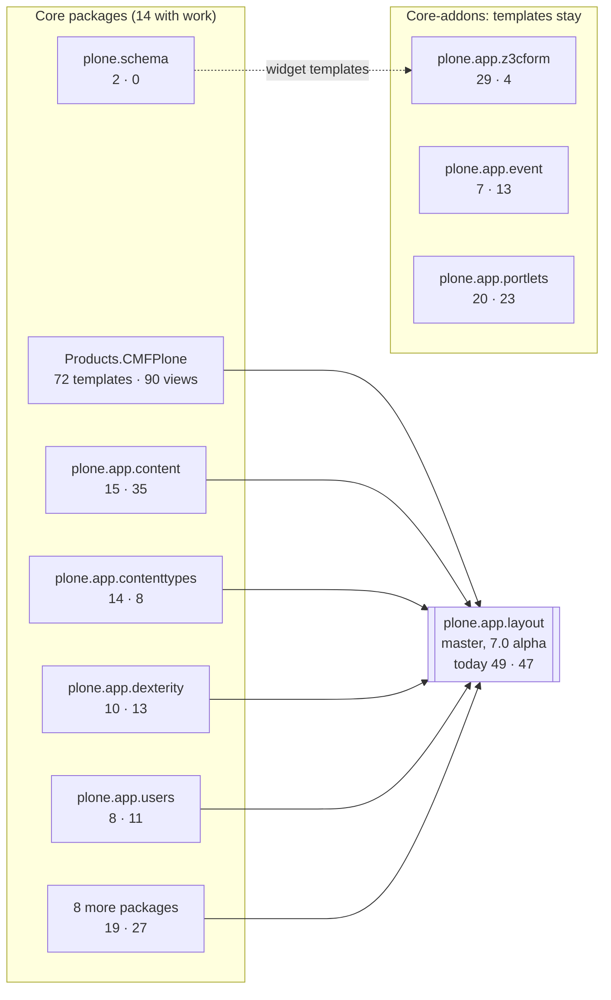
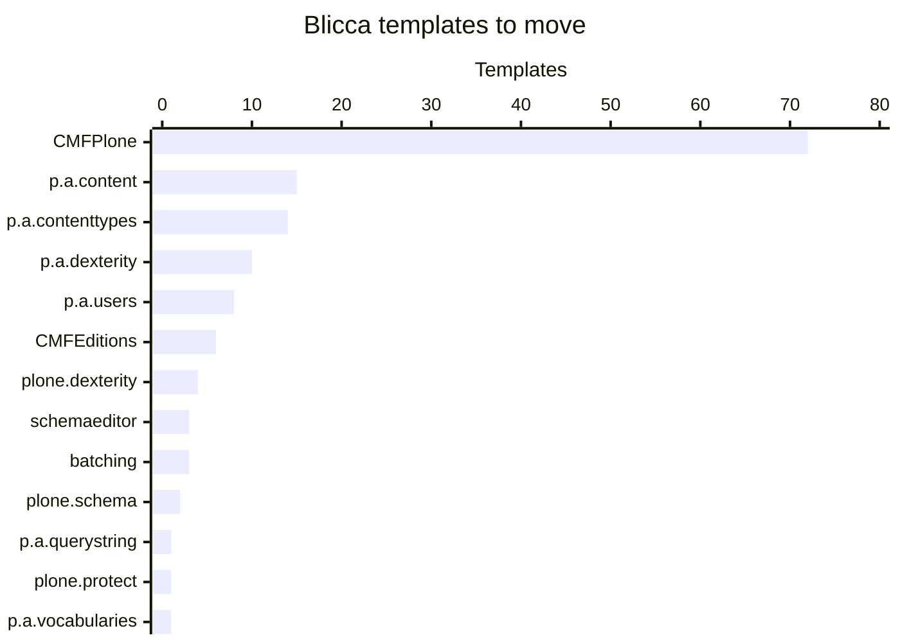
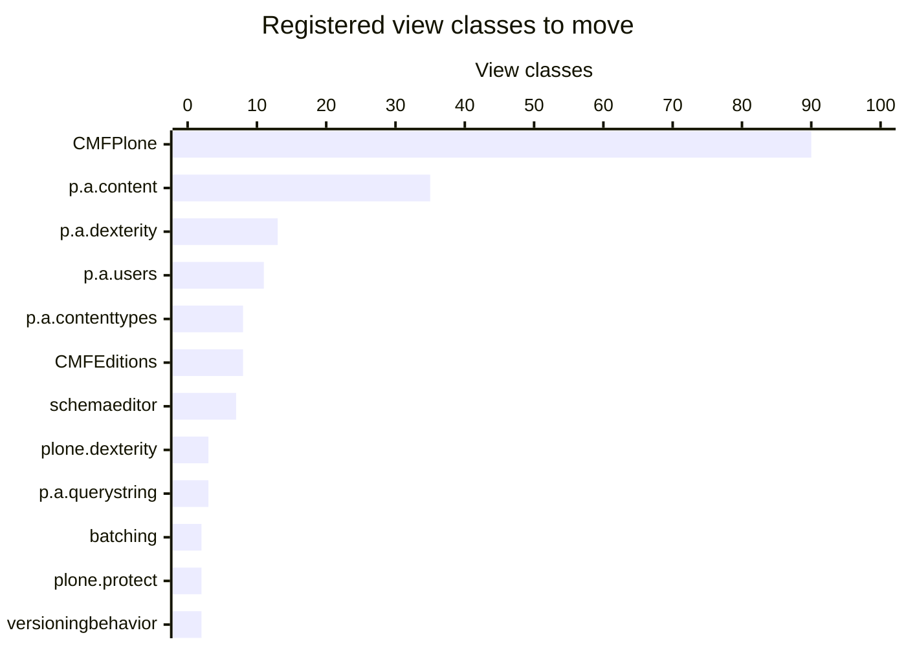
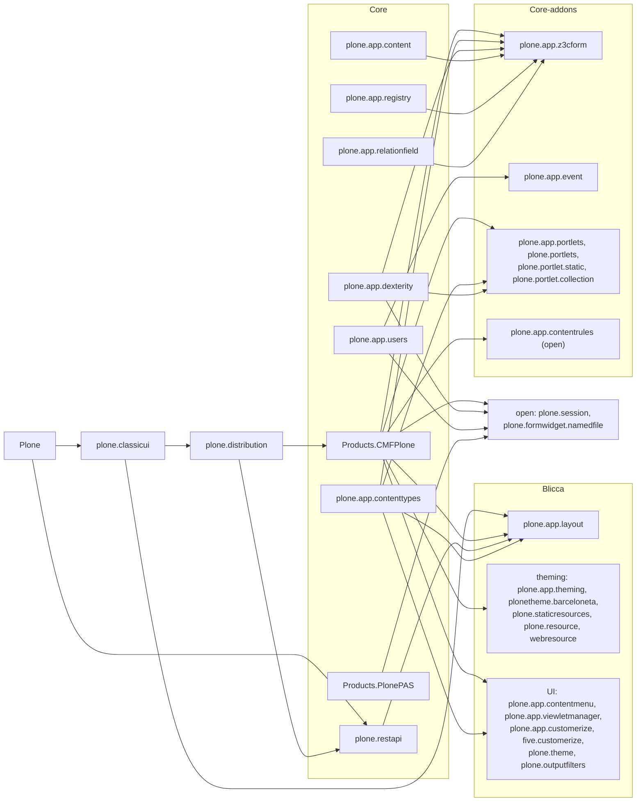
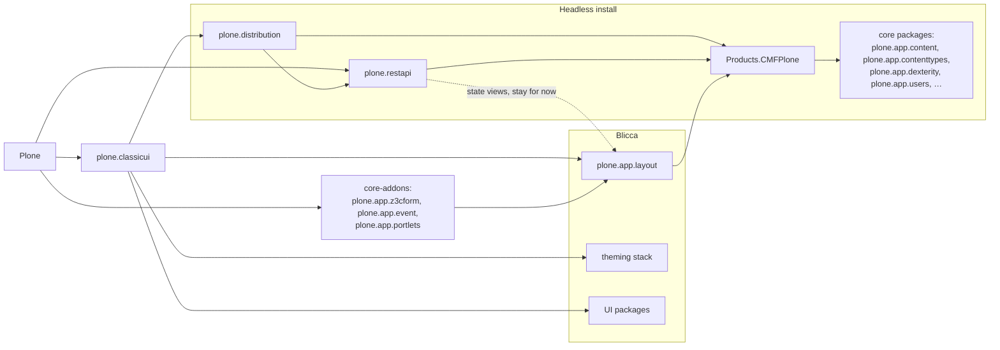

# Blicca separation: overview

140 Blicca templates and 184 registered view classes in 14 core packages move to `plone.app.layout`.
Core-addons keep theirs.
Part of [PLIP #3953](https://github.com/plone/Products.CMFPlone/issues/3953); the rules are in [blicca-separation-spec.md](blicca-separation-spec.md).

As of 2026-09-26, measured in `buildout.coredev` 6.3 (`Products.CMFPlone` from `master`).

## Where the templates and views go

## Templates and view classes per package

| Package | Category | Blicca templates | View classes | Destination |
| --- | --- | ---: | ---: | --- |
| Products.CMFPlone | Core | 72 | 90 | plone.app.layout |
| plone.app.content | Core | 15 | 35 | plone.app.layout |
| plone.app.contenttypes | Core | 14 | 8 | plone.app.layout |
| plone.app.dexterity | Core | 10 | 13 | plone.app.layout |
| plone.app.users | Core | 8 | 11 | plone.app.layout |
| Products.CMFEditions | Core | 6 | 8 | plone.app.layout |
| plone.dexterity | Core | 4 | 3 | plone.app.layout |
| plone.schemaeditor | Core (split) | 3 | 7 | plone.app.layout, API stays |
| plone.batching | Core (split) | 3 | 2 | plone.app.layout, `Batch` stays |
| plone.schema | Core | 2 | 0 | plone.app.z3cform |
| plone.app.querystring | Core (split) | 1 | 3 | plone.app.layout, API stays |
| plone.protect | Core | 1 | 2 | plone.app.layout |
| plone.app.vocabularies | Core (split) | 1 | 0 | plone.app.layout, vocabularies stay |
| plone.app.versioningbehavior | Core | 0 | 2 | plone.app.layout |
| **Total to move** | | **140** | **184** | |
| plone.locking, plone.app.contentlisting, plone.app.workflow, plone.app.linkintegrity, plone.app.redirector | Core (check) | 0 | 8 | check whether API |
| plone.app.textfield | Core (keep) | 3 | 1 | stays |
| plone.formwidget.namedfile | Core (keep) | 4 | 1 | stays |
| plone.app.z3cform | Core-addon | 29 | 4 | stays |
| plone.app.event | Core-addon | 7 | 13 | stays |
| plone.app.portlets | Core-addon | 20 | 23 | stays |
| plone.app.contentrules | open | 3 | 39 | open question |
| plone.app.layout | Blicca (target) | 49 | 47 | receives the moves |

## Dependency graph today

Every solid arrow is a core package that pulls a Blicca or core-addon package into a headless install (21 packages over 9 core packages).

## Dependency graph after a later restructuring

Documentation only: implementing this is out of scope of the PLIP (D9).
The headless install (`plone.distribution`, `Products.CMFPlone`, `plone.restapi`) no longer reaches Blicca packages, except through the state views that stay in `plone.app.layout` for now (dashed).

## How the numbers were produced

- **Blicca templates:** non-test `.pt` files in the installed package, minus ZMI templates (paths containing `zmi`, `manage` or `www/`).
- **View classes:** unique `class` (or portlet `renderer`) values of `browser:page`, `browser:view`, `browser:viewlet`, `browser:viewletManager` and `plone:portlet` registrations in non-test ZCML.
- **Dependencies:** `install_requires` closure of `Products.CMFPlone`, `plone.distribution` and `plone.restapi`, stopping at the first Blicca or core-addon package.
- Unreleased PR branches are not included.
